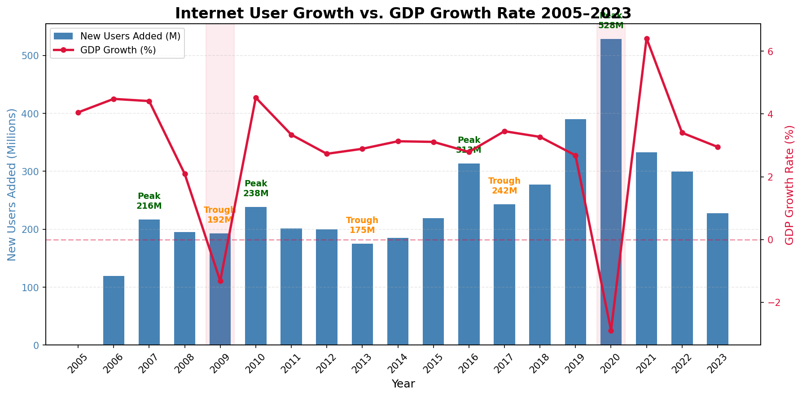
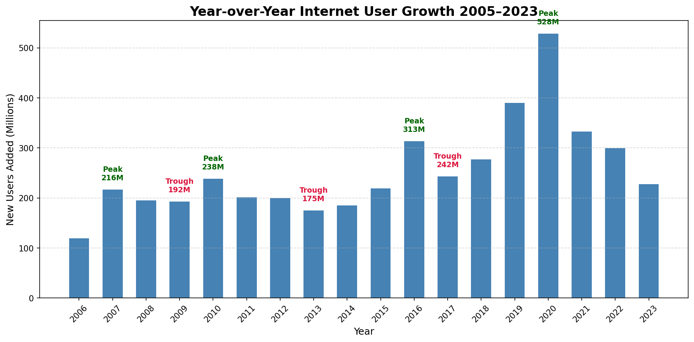

# Internet Traffic Analysis: Mapping Global Adoption 2005–2023

A data science investigation into global internet user growth, identifying cyclical adoption patterns and testing the relationship between economic conditions and adoption rates.

---

## The Question

Global internet adoption has grown for decades — but is it smooth and continuous, or does it follow identifiable cycles? And when economic shocks hit, does adoption slow with the economy or push through independently?

---

## Data Sources

| Dataset | Source | Indicator |
|---|---|---|
| Internet users (% of population) | World Bank API (ITU) | `IT.NET.USER.ZS` |
| Global population | World Bank API | `SP.POP.TOTL` |
| GDP growth rate | World Bank API | `NY.GDP.MKTP.KD.ZG` |

**Coverage:** 2005–2023 (19 years), global aggregate (`WLD`)

**Methodology:** Internet user percentage and population data were fetched separately from the World Bank API, saved as raw JSON, then merged to derive absolute internet users in millions. Raw files are preserved untouched; all transformations applied to parsed copies.

---

## Findings

### Finding 1 — Adoption is Recession-Resistant

Global GDP contracted sharply in 2009 (financial crisis) and 2020 (COVID). In both cases, internet adoption continued growing — GDP crashed, new user counts barely flinched.



This suggests internet adoption is driven primarily by structural factors — infrastructure buildout, device affordability, platform utility — rather than discretionary economic conditions. Access, once available, is treated as essential.

---

### Finding 2 — Cyclical Peaks and Troughs

Adoption does not grow smoothly. Year-over-year new user counts show a clear cyclical pattern with peaks and troughs repeating across the observation window.



| Year | Event | New Users |
|---|---|---|
| 2007 | Cycle peak | 216M |
| 2009 | Trough | 192M |
| 2010 | Cycle peak | 238M |
| 2013 | Trough | 175M |
| 2016 | Cycle peak | 313M |
| 2017 | Trough | 242M |
| 2020 | COVID peak | 528M |
| 2023 | Post-shock low | 228M |

Each successive peak is higher than the last — consistent with a growing global user base generating larger absolute additions even at declining percentage growth rates.

---

### Finding 3 — The 2020 COVID Effect and Post-Shock Depletion

The 2020 spike (528M new users) is the largest single-year addition in the dataset — more than double the prior cycle peak. COVID-driven remote work, education, and commerce requirements pulled forward adoption that would have occurred over multiple subsequent years.

The sharp post-2020 decline to 228M by 2023 is consistent with addressable user pool depletion: the population most likely to join next joined early, leaving a harder-to-reach remainder.

---

### Open Hypothesis — Cyclical Superposition

The regularity of peaks and troughs across the dataset raises the question of whether adoption cycles reflect constructive interference of independent adoption waves — infrastructure deployment cycles, device affordability cycles, and platform utility cycles operating on different timescales and periodically aligning.

This hypothesis is noted but not tested here. It would require decomposing adoption drivers at a more granular level than global aggregate data supports.

---

## Skills Demonstrated

- World Bank API data retrieval (multi-indicator, JSON parsing)
- Raw data preservation with separate transformation pipeline
- Absolute metric derivation from percentage and population data
- Time series analysis and inflection point identification
- Dual-axis visualization (bar + line overlay) with matplotlib
- Hypothesis generation from observed patterns with honest scope boundaries

**Tools:** Python, pandas, matplotlib, Jupyter Notebook, World Bank API

---

## Repository Structure

```
Internet Traffic Analysis/
├── README.md
├── Notebooks/
│   ├── 01 Phase 1 - ITU.ipynb
│   └── 02 Phase 2 - Exploratory Analysis.ipynb
├── Charts/
│   ├── 03_yoy_annotated.png
│   └── 05_users_vs_gdp_annotated.png
└── Data/
    └── README.md
```

---

## Data Availability

Raw data files are not included due to file size. All data is freely available via the World Bank API:

- [World Bank API — Internet Users](https://data.worldbank.org/indicator/IT.NET.USER.ZS)
- [World Bank API — Population](https://data.worldbank.org/indicator/SP.POP.TOTL)
- [World Bank API — GDP Growth](https://data.worldbank.org/indicator/NY.GDP.MKTP.KD.ZG)
